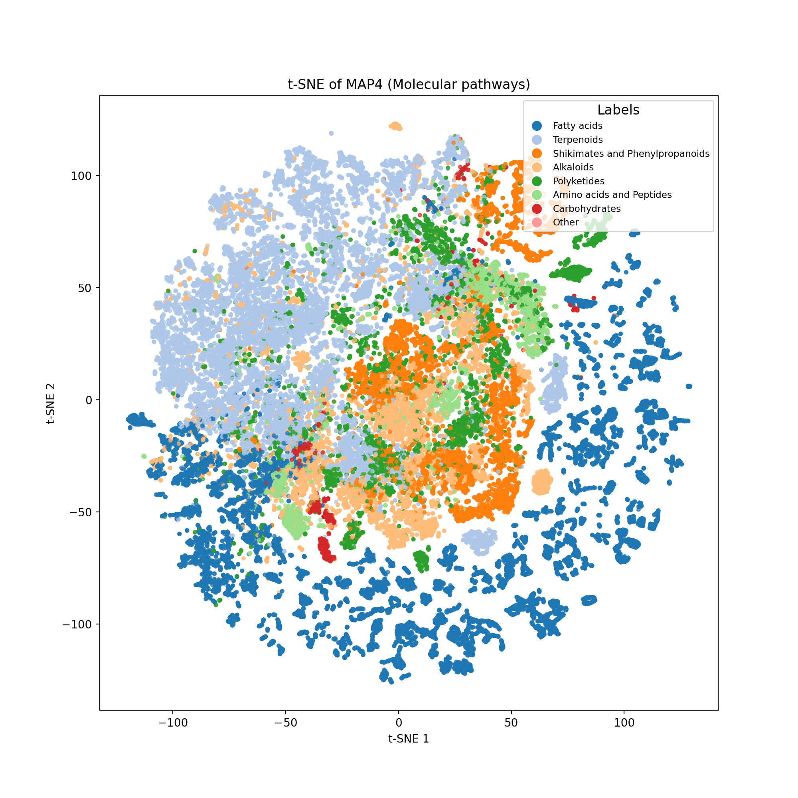

# MAP4

Map4 is a MinHash-based molecular fingerprint.

## How to install

As usual, you can simply install the package using pip:

```bash
pip install map4
```

## Examples

Given a SMILES string, you can generate the MAP4 fingerprint as follows:

```python
from rdkit.Chem import MolFromSmiles, Mol # pylint: disable=import-error,no-name-in-module
import numpy as np
from map4 import MAP4

map4 = MAP4(
    # The size of the MinHash-based fingerprint
    dimensions=2048,
    # The radius of the circular substructures to consider
    radius=2,
    # Whether to include duplicated shingles, which we can
    # make unique by extending them with a counter
    include_duplicated_shingles=False,
)

molecule: Mol = MolFromSmiles("CCO")
fingerprint: np.ndarray = map4.calculate(molecule)

assert fingerprint.shape == (2048,)
```

Map4 also provides a multiprocessing-based implementation to calculate the fingerprints of a list of molecules:

```python
from typing import List
import numpy as np
from rdkit.Chem import Mol, MolFromSmiles # pylint: disable=import-error,no-name-in-module
from map4 import MAP4

map4 = MAP4(
    dimensions=2048,
    radius=2,
    include_duplicated_shingles=False,
)

molecules: List[Mol] = [MolFromSmiles("CCO"), MolFromSmiles("CCN")]
fingerprints: List[np.ndarray] = map4.calculate_many(
    molecules,
    # The number of threads to use
    number_of_threads=2,
    # Whether to show a progress bar
    verbose=True,
)

assert len(fingerprints) == 2
assert fingerprints[0].shape == (2048,)
assert fingerprints[1].shape == (2048,)
```

Finally, the fingerprints can be visualized using the `visualize` method, which computes a TSNE of the fingerprints of the provided molecules.

You can find an example of how to use the `visualize` method in the `test_visualize.py` file. Here's a preview:



## Using the CLI

Map4 also provides a command-line entry-point called `map4`. This command-line interface (CLI) provides a way to compute MAP4 fingerprints for a batch of molecules using SMILES input. The fingerprints can be customized via various options such as fingerprint dimensions, radius, and batch size. The entry-point is available once the package is installed, so no additional setup is required.

```bash
map4 --input-path <input_file> --output-path <output_file> [options]
```

### Required Arguments

- `--input-path, -i`: Path to the input file containing molecules in SMILES format.
- `--output-path, -o`: Path to the output file where the fingerprints will be saved.

### Optional Arguments

- `--dimensions, -d`: Number of dimensions for the MinHashed fingerprint. Choices: `[128, 512, 1024, 2048]`. Default: `1024`.
- `--radius, -r`: Radius of the fingerprint. Default: `2`.
- `--include-duplicated-shingles`: Whether to include duplicated shingles in the fingerprint. Default: `False`.
- `--clean-mols`: Whether to clean and canonicalize the molecules before fingerprint calculation. Default: `True`.
- `--delimiter`: Delimiter used in both input and output files. Default: `\t`.
- `--fp-delimiter`: Delimiter used between the numbers in the fingerprint output. Default: `;`.
- `--batch-size, -b`: Number of molecules to process in a batch. Default: `500`.

### Example

```bash
map4 -i molecules.smi -o fingerprints.txt -d 1024 -r 2 --clean-mols True --batch-size 1000
```

This command processes molecules from `molecules.smi`, computes 1024-dimensional MAP4 fingerprints, and outputs them to `fingerprints.txt`.

## Repository structure

Folder description:

- `Extended-Benchmark`: compounds and query lists used for the peptide benchmark
- `MAP4-Similarity-Search`: source code for the similarity search app
- `map4`: MAP4 fingerprint source code

## Design and Documentation  

The canonical, not isomeric, and rooted SMILES of the circular substructures `CS` from radius one up to a user-given radius `n` (default `n=2`, `MAP4`) are generated for each atom. All atom pairs are extracted, and their minimum topological distance `TP` is calculated. For each atom pair `jk`, for each considered radius `r`, a `Shingle` is encoded as: `CS`<sub>`rj`</sub>`|TP`<sub>`jk`</sub>`|CS`<sub>`rk`</sub> , where the two `CS` are annotated in alphabetical order, resulting in n Shingles for each atom pairs.

The resulting list of Shingles is hashed using the unique mapping `SHA-1` to a set of integers `S`<sub>`i`</sub>, and its correspondent transposed vector `s`<sup>`T`</sup><sub>`i`</sub> is MinHashed.

## MAP4 - Similarity Search of ChEMBL, Human Metabolome, and SwissProt

Draw a structure or paste its SMILES, or write a natural peptides linear sequence.
Search for its analogs in the MAP4 or MHFP6 space of ChEMBL, of the Human Metabolome Database (HMDB), or of the 'below 50 residues subset' of SwissProt.

The MAP4 search can be found at: <http://map-search.gdb.tools/>.

The code of the MAP4 similarity search can be found in this repository folder `MAP4-Similarity-Search`

To run the app locally:

- Download the MAP4SearchData [](https://doi.org/10.5281/zenodo.3671214)
- Run `docker run -p 8080:5000 --mount type=bind,target=/MAP4SearchData,source=/your/absolut/path/MAP4SearchData  --restart always --name mapsearch alicecapecchi/map-search:latest`
- The MAP4 similarity search will be running at <http://0.0.0.0:8080/>

## Extended Benchmark

Compounds and training list used to extend the Riniker et. al. fingerprint benchmark (Riniker, G. Landrum, J. Cheminf., 5, 26 (2013), DOI: 10.1186/1758-2946-5-26, URL: <http://www.jcheminf.com/content/5/1/26>, GitHub page: <https://github.com/rdkit/benchmarking_platform>) to peptides.
